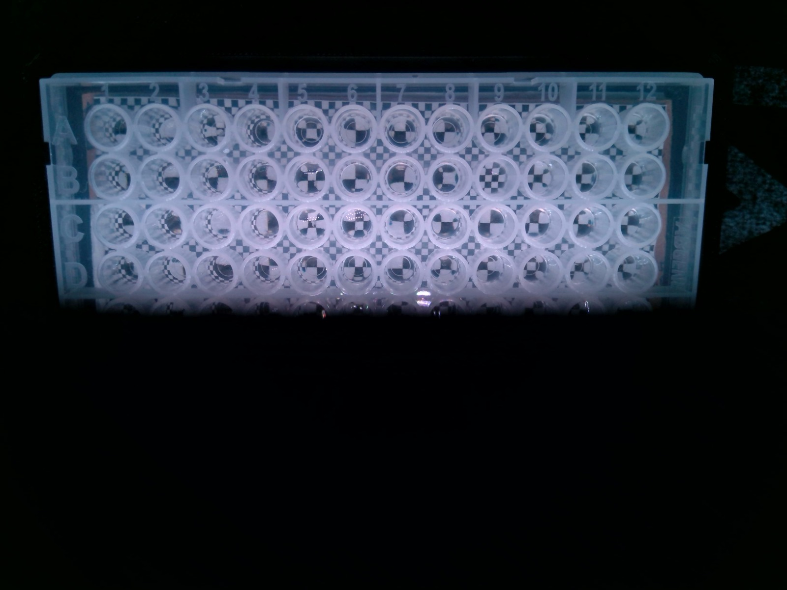

<p align="center">
  <a href="https://aventix.io">
    
  </a>
</p>

# Patterns by Aventix

<p>
  <a href="https://patterns.aventix.io"></a>
  <a href="https://aventix.io"></a>
  <a href="mailto:hello@aventix.io"></a>
</p>

This web application lets you generate, preview, and print structured imaging patterns — configurable backgrounds designed to improve contrast and repeatability when imaging liquids in well plates and other microfluidic formats.

## Background

At [Aventix](https://aventix.io) we develop sensor technologies for AI, bioanalytics, and scientific research. One recurring challenge when imaging transparent or semi-transparent liquids (such as DMSO, buffer solutions, or cell media) in well plates is poor contrast against plain backgrounds. Placing the well plate on top of a printed structured pattern dramatically improves image quality and signal extraction.

<p align="center">
  
  <br/>
  <em>A microplate filled with DMSO imaged over a structured pattern background.</em>
</p>

## Open tooling philosophy

Aventix builds a lot of small internal tools to support our science. We believe in democratising technology — when a tool is generic enough to be useful beyond our own lab, we open-source it. **Patterns** is one of those tools. If it saves you time in your workflow, we would love to hear about it.

## Features

- Five built-in patterns: Speckle, Checkerboard, PRBA, Stripes, Sinusoidal grating
- Physical unit control — set dimensions in mm or inches, resolution in DPI or px/mm
- Live preview with mm rulers and correct paper aspect ratio
- Export as high-resolution JPEG or send directly to print
- Paper format presets (A4, A5, Letter, Microplate) plus custom sizes
- Runs entirely in the browser — no server, no data leaves your machine

## Development

```bash
pnpm install
pnpm run dev    # start dev server
pnpm build      # production build
```
---

*Developed and maintained by [Aventix AB](https://aventix.io), Molndal, Sweden.*